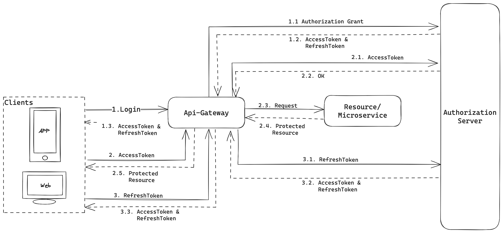

# Api-Gateway
 Example about an api gateway application with Spring Cloud Gateway.

Demo config routes to apply filters (like a instronspect token), predicates (url and headers) and modify requests

## Flow




### Ednpoints

```bash
curl --location 'http://localhost:8081/actuator/gateway/routes/prueba'
```
```bash
curl --location 'http://localhost:8081/actuator/gateway/routes'
```

```bash
curl --location --request GET 'http://localhost:8081/edge-service/v1/httpbin' \
--header 'scope: httpbin' \
--header 'Authorization: Bearer PruebaAutorización' \
--header 'Content-Type: application/json; charset=UTF-8' \
--data '{
    "header": {
        "id": "almidón"
    }
}'
```